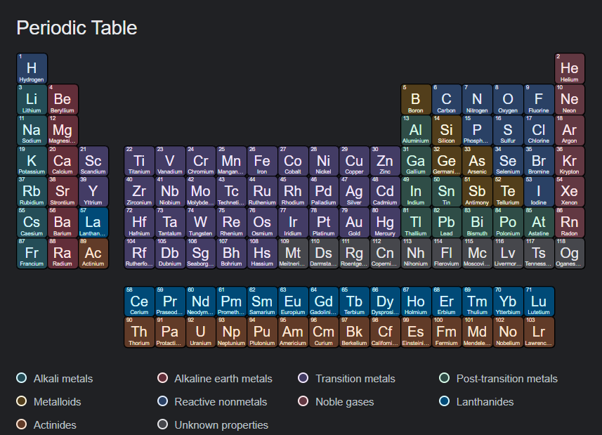

### Description

This could test my deep understanding about grid and flexbox layouts

## Disclaimer

If you typed <i><b>'periodic table of elements'</b></i> in the google, you'll see the same design to this.
or you can click <a href="https://www.google.com/search?q=periodic+table+of+elements&rlz=1C1GCEA_enPH998PH998&oq=periodic+table+of+elements+&aqs=chrome..69i57j35i39j0i512l6j0i67j0i512.5157j0j1&sourceid=chrome&ie=UTF-8#wptab=s:H4sIAAAAAAAAAONgVuLQz9U3MC1KKn7EaMwt8PLHPWEprUlrTl5jVOHiCs7IL3fNK8ksqRQS42KDsnikuLjgmnh2MXHkl6UWlWWmli9ilSpILcrMT8lMVihJTMpJVchPU0jNSc1NzSspBgC3syBragAAAA">here</a>

### Actual screenshot
